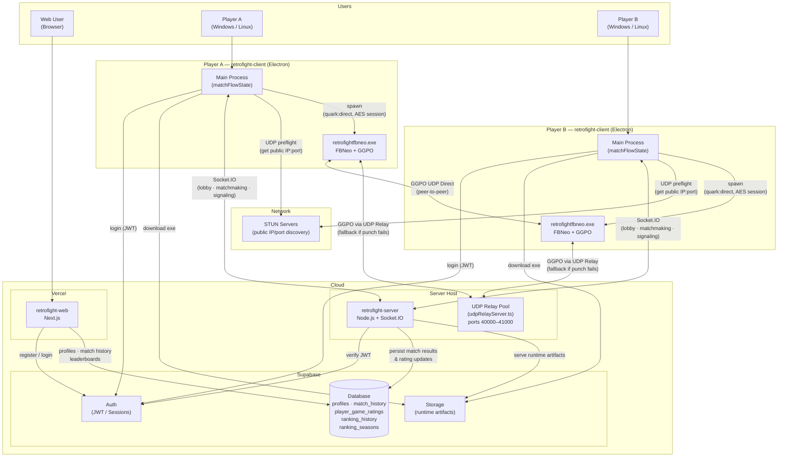
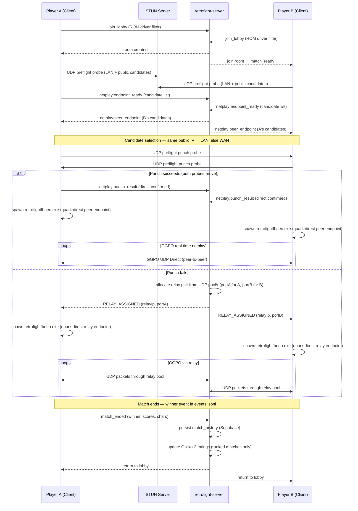
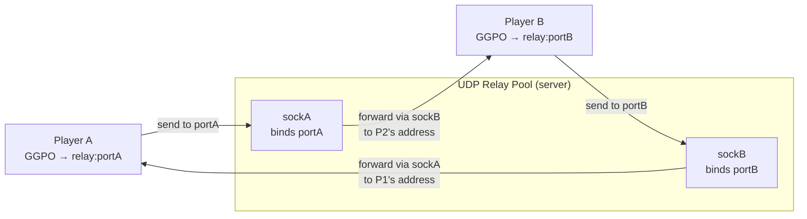
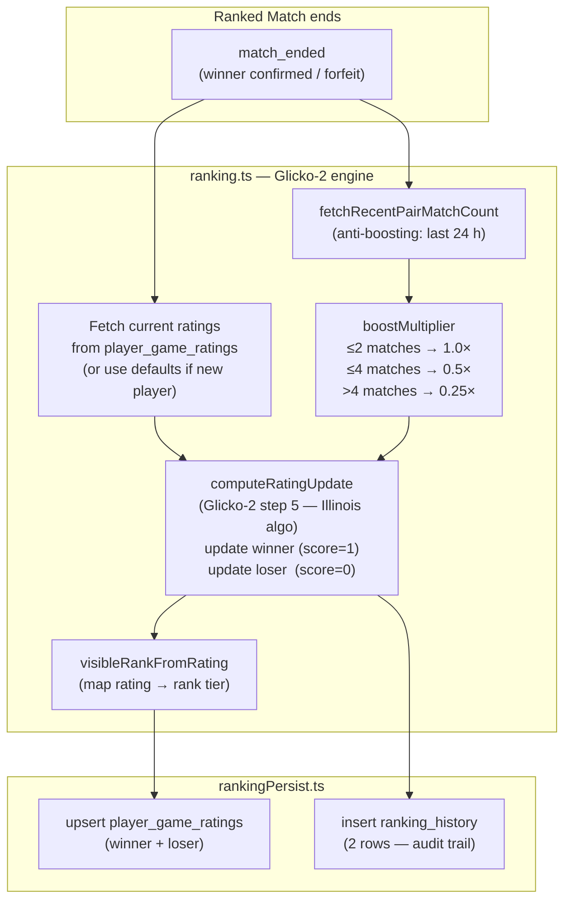
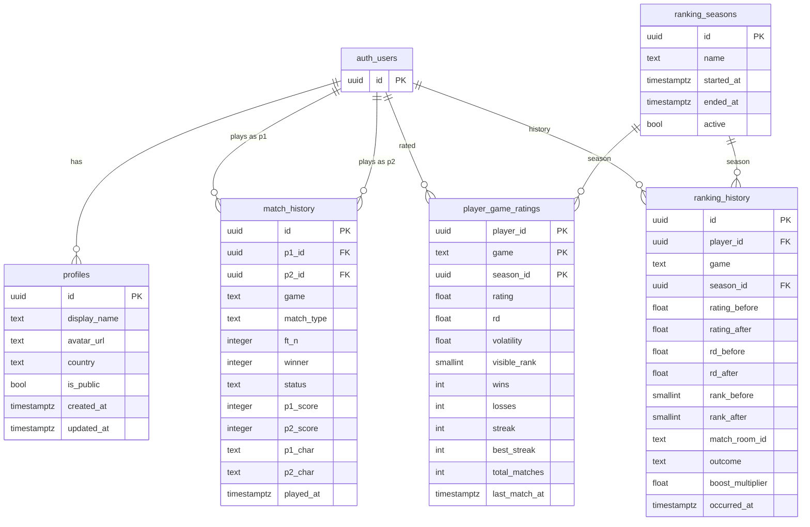
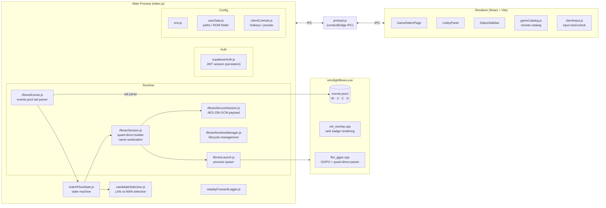
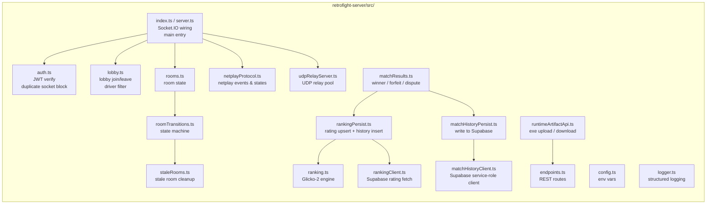
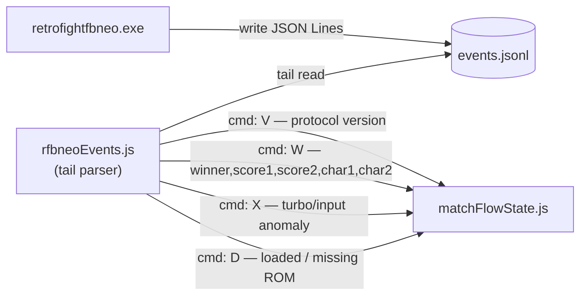
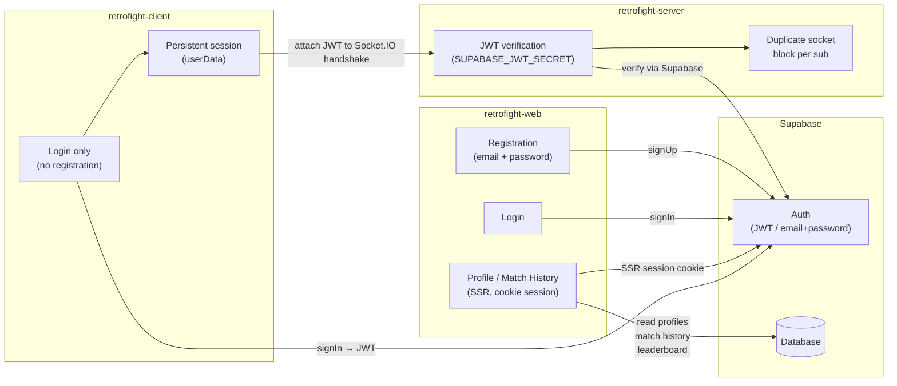
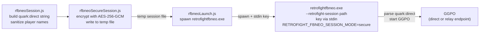

# RetroFight — System Architecture

## Repositories

| Repo | Tech | Description |
|------|------|-------------|
| `retrofight-server` | Node.js + Socket.IO + TypeScript | Signaling broker, matchmaking, UDP relay, ranking, match history |
| `retrofight-client` | Electron + React/Vite (CommonJS) | Desktop app — Windows & Linux |
| `retrofight-fbneo` | C++ (Win32) | Custom FinalBurn Neo with GGPO UDP netplay |
| `retrofight-web` | Next.js + Supabase | Landing page, auth, profiles, match history, leaderboards |
| `retrofight-releases` | — | Public release artifacts, release notes, wiki |
| `retrofight-legal` | — | Terms of Use, Privacy Policy, disclaimers |

---

## System Overview

---

## Netplay Match Flow

The server first attempts UDP direct (hole-punching). If punch fails, it falls back to a server-side UDP relay — GGPO is agnostic to the transport as long as the port numbers match.

---

## UDP Relay Pool

The relay is server-side, UDP-only, designed to be GGPO-transparent. Each session gets two dedicated sockets: one port per player. Packets arriving on player A's port are forwarded via player B's socket (so GGPO sees the source as the relay port it expects), and vice versa.

**Pool parameters (defaults):**

| Parameter | Default |
|-----------|---------|
| Port range | 40000 – 41000 (1 000 ports) |
| Session timeout | 90 s of inactivity |
| Sweep interval | every 30 s |
| Bind IP | `0.0.0.0` |

If the pool is exhausted the server closes the room with reason `punch_failed_relay_pool_exhausted`.

---

## Glicko-2 Ranking System

Ratings are computed per-player, per-game, per-season using the Glicko-2 algorithm (Illinois convergence for volatility). The internal Glicko-2 values are never exposed to clients; only the integer `visible_rank` (0–6) is shown.

### Rank tiers

| Rank | ID | Min rating |
|------|----|-----------|
| NR   | 0  | — (0 ranked matches completed) |
| E    | 1  | 0 |
| D    | 2  | 1 300 |
| C    | 3  | 1 500 (starting point) |
| B    | 4  | 1 700 |
| A    | 5  | 1 900 |
| S    | 6  | 2 100 |

### Glicko-2 parameters

| Parameter | Value |
|-----------|-------|
| Initial rating | 1 500 |
| Initial RD | 350 |
| Initial volatility | 0.06 |
| τ (system constant) | 0.5 |
| Scale factor | 173.7178 |

RD inflation is applied per rating period for inactive players (`applyRdInflation`).

---

## Database Schema (Supabase)

**RLS summary:**

| Table | Public read | Own read | Write |
|-------|-------------|----------|-------|
| `profiles` | if `is_public = true` | yes | own row |
| `match_history` | if profile is public | yes | service role |
| `player_game_ratings` | if profile is public | yes | service role |
| `ranking_history` | if profile is public | yes | service role |
| `ranking_seasons` | yes (everyone) | — | service role |

---

## Client Internal Architecture

---

## Server Internal Architecture

---

## FBNeo Runtime Events

Events written by `retrofightfbneo.exe` to `events.jsonl` and consumed by `rfbneoEvents.js`:

> `cmd: C` (internal peer command) is ignored — never interpreted as a score event.

---

## Authentication Flow

---

## Secure Session (quark:direct payload)

---

## Key Notes

- **Rank overlay** — always shows `rank0` because `RetrofightSetDirectGameInfo()` hardcodes `#0,0,0`; Glicko-2 ranks are stored in DB but a protocol extension is needed to pass them into the runtime badge.
- **`ranked` field** in `quark:direct` is the match format (0 = versus, 1 = ranked, 2+ = FTN), not the player's rank badge.
- **`launcher.js` is legacy** — not part of the main match flow.
- **Anti-boosting** — the same pair playing more than 2 ranked matches in 24 h receives reduced rating deltas (0.5× or 0.25×) to prevent farming.
- **NULL season** — `season_id IS NULL` in `player_game_ratings` represents all-time totals; a unique partial index enforces one row per `(player_id, game)` when no season is active.

## Legal documents

- [Legal Notice](https://github.com/Retrofight/retrofight-legal/blob/main/LEGAL_NOTICE.md)
- [Terms of Use](https://github.com/Retrofight/retrofight-legal/blob/main/TERMS_OF_USE.md)
- [First Run Disclaimer](https://github.com/Retrofight/retrofight-legal/blob/main/FIRST_RUN_DISCLAIMER.md)
- [Download Disclaimer](https://github.com/Retrofight/retrofight-legal/blob/main/DOWNLOAD_DISCLAIMER.md)
- [Third-Party Content Notice](https://github.com/Retrofight/retrofight-legal/blob/main/THIRD_PARTY_CONTENT.md)
- [Copyright Policy](https://github.com/Retrofight/retrofight-legal/blob/main/COPYRIGHT_POLICY.md)
- [Legal FAQ](https://github.com/Retrofight/retrofight-legal/blob/main/FAQ_LEGAL.md)
